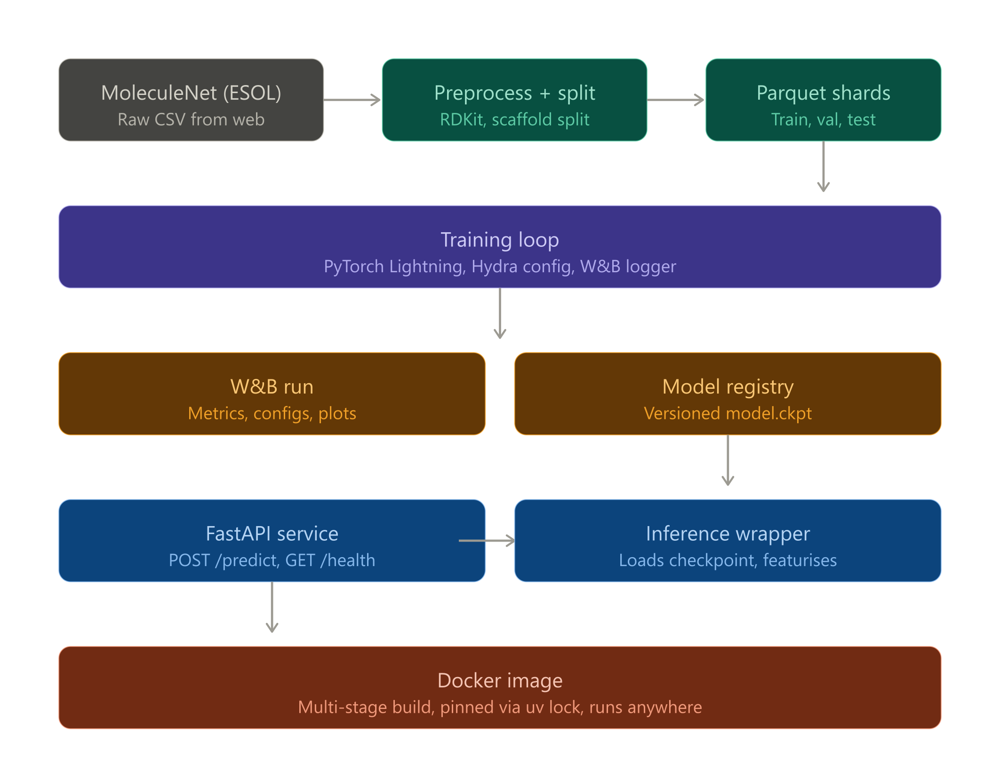

# Intro

This is an experimental project, which I use to learn ML/MLOps and how it is applicable to bioinformatics

Very first steps, I'm not quite sure what the project will look like in the end, but hope it will be fun!

The purpose of the project is to put any knowledge gained from `TeachOpenCadd` and `Bioinformatics Data Skills` into practise, learning ML production code along the way.

# Description
It trains Chemprop (Graph Neural Network. [Github](https://github.com/chemprop/chemprop)) on sollubilty using the [ESOL dataset](https://huggingface.co/datasets/scikit-fingerprints/MoleculeNet_ESOL/raw/main/esol.csv) (link as of 2026-05-12)

# Proposed repo structure
```
bioinformatics-ml/
├── pyproject.toml              # uv/poetry, pinned deps
├── uv.lock                     # exact versions, committed
├── Dockerfile                  # multi-stage build
├── docker-compose.yml          # local dev: API + optional W&B proxy
├── README.md                   # architecture diagram + quickstart
│
├── configs/                    # Hydra configs
│   ├── config.yaml             # default composition
│   ├── data/
│   ├── model/
│   └── trainer/
│
├── src/
│   ├── __init__.py
│   ├── data/
│   ├── models/
│   ├── train.py                # entrypoint: `python -m chemprop_demo.train`
│   ├── evaluate.py             # standalone eval against held-out test
│   └── serve/
│       ├── app.py              # FastAPI app
│       ├── models              
│       │   └── schemas.py      # Pydantic request/response models
│       └── inference.py        # loads checkpoint, runs prediction
│
├── tests/                      # Tests
│
├── notebooks/                  # Jupyter notebooks
│
└── .github/workflows/
    ├── ci.yml                  # tests + linting on every PR
    └── build.yml               # build + push Docker image on main
```

# Proposed architecture
